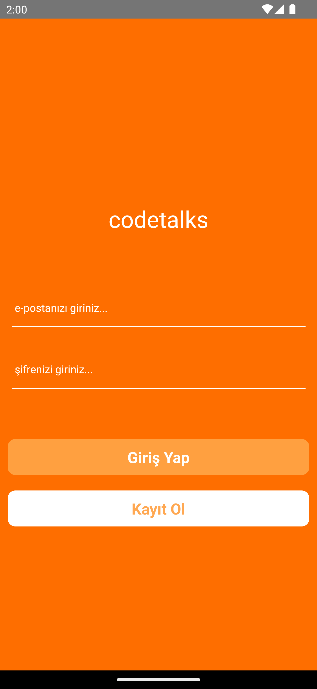
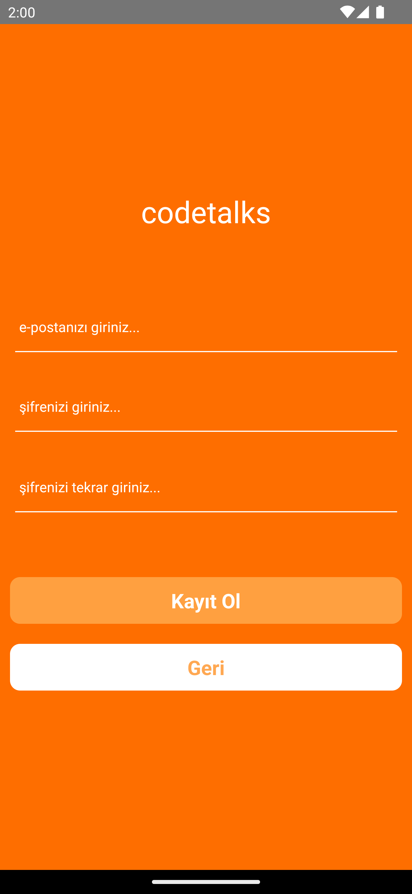
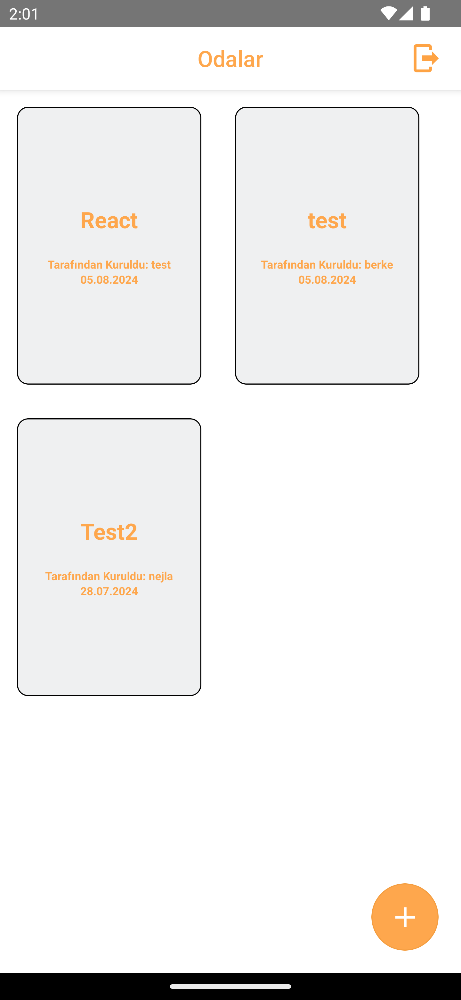
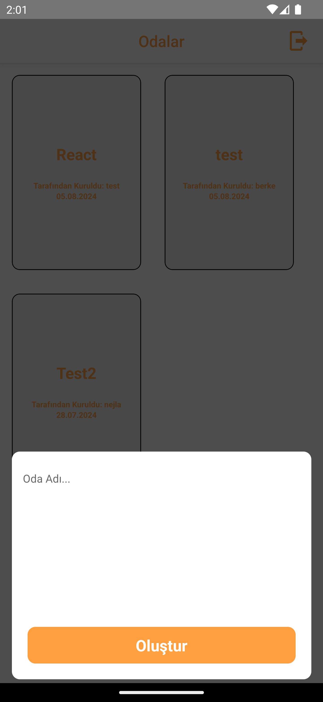
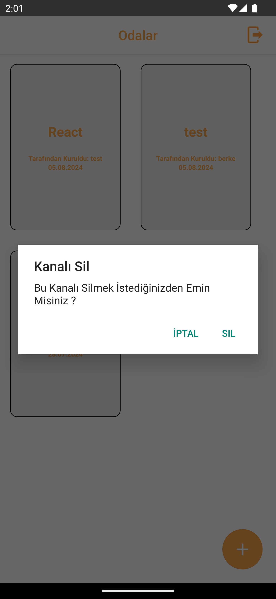
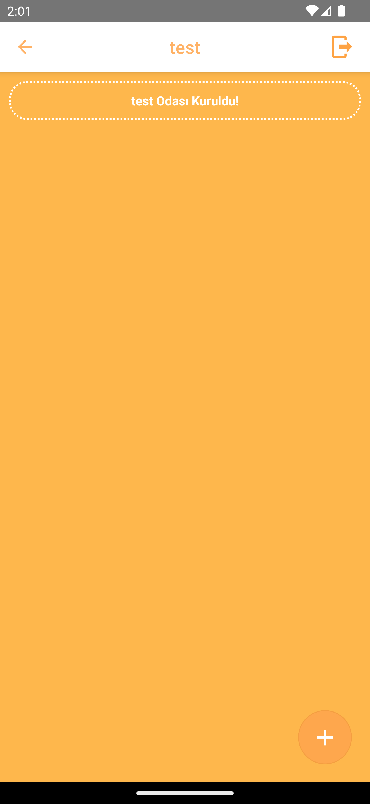
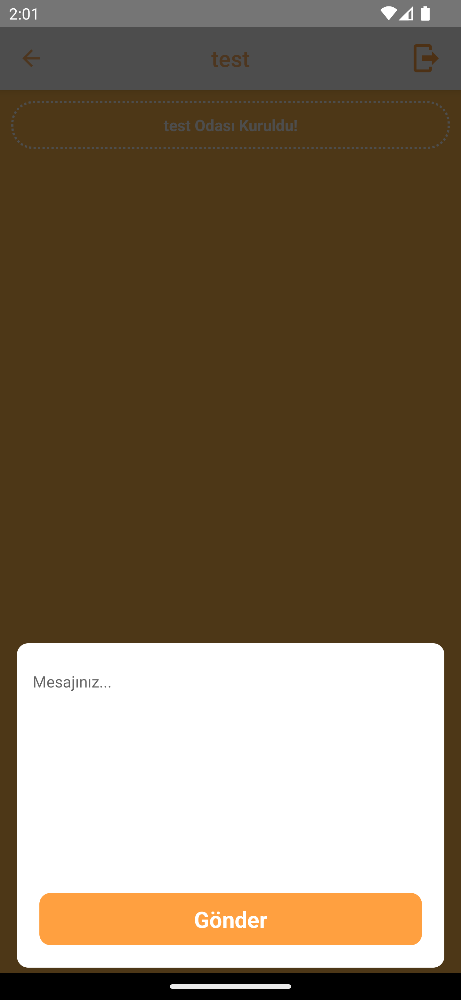
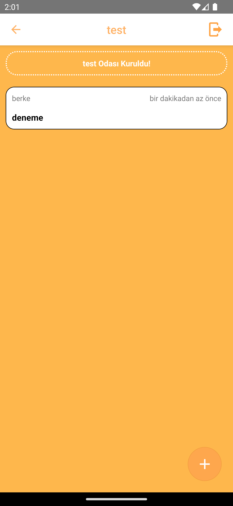
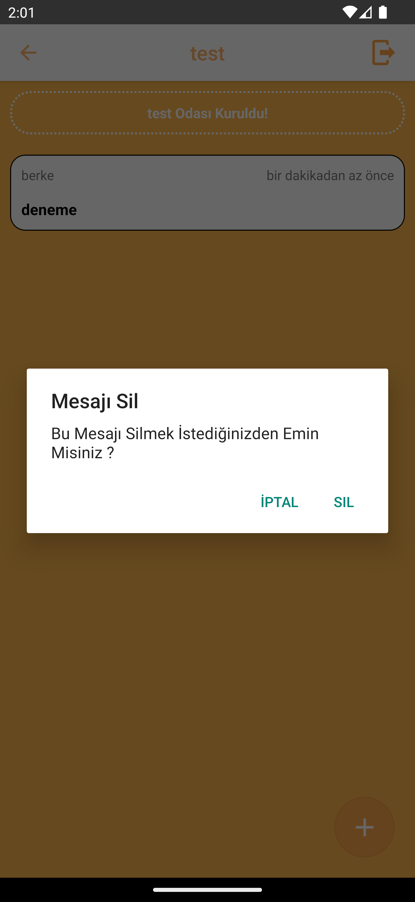

# codetalks
## Overview

codetalks is a mobile application developed using React Native. The app focuses on providing a platform for users to engage in meaningful discussions about coding, share knowledge, and collaborate on various topics. The application integrates Firebase for real-time data management and authentication, ensuring a seamless user experience

## Features

- User Authentication: Users can sign up and log in using their email and password. Firebase Authentication ensures secure user management.
- Real-Time Messaging: Users can create channels, send messages, and interact with others in real time. All messages are stored and synchronized using Firebase Real-time Database.
- Animations: Lottie animations are used to enhance the user experience, appearing as overlays in the app.

## Libraries Used

- @react-native-firebase/app: Core Firebase integration.
- @react-native-firebase/auth: Firebase Authentication for user sign-up and login.
- @react-native-firebase/database: Firebase Real-time Database for managing real-time data.
- @react-navigation/native: Navigation library for managing the app's navigation.
- @react-navigation/native-stack: Stack navigator for managing screen transitions.
- date-fns: Utility library for manipulating and formatting dates.
- formik: Form handling and validation library.
- lottie-react-native: Lottie animations for enhanced UI/UX.
- react-native-flash-message: Library for displaying flash messages to users.
- react-native-modal: Modal components for creating overlays and dialogs.
- react-native-safe-area-context: Ensures safe area views for different devices.
- react-native-screens: Optimizes screen usage for better performance.
- react-native-vector-icons: Icons for use in buttons, menus, and other UI elements.
- yup: Validation schema builder used alongside Formik.

## Screenshots

